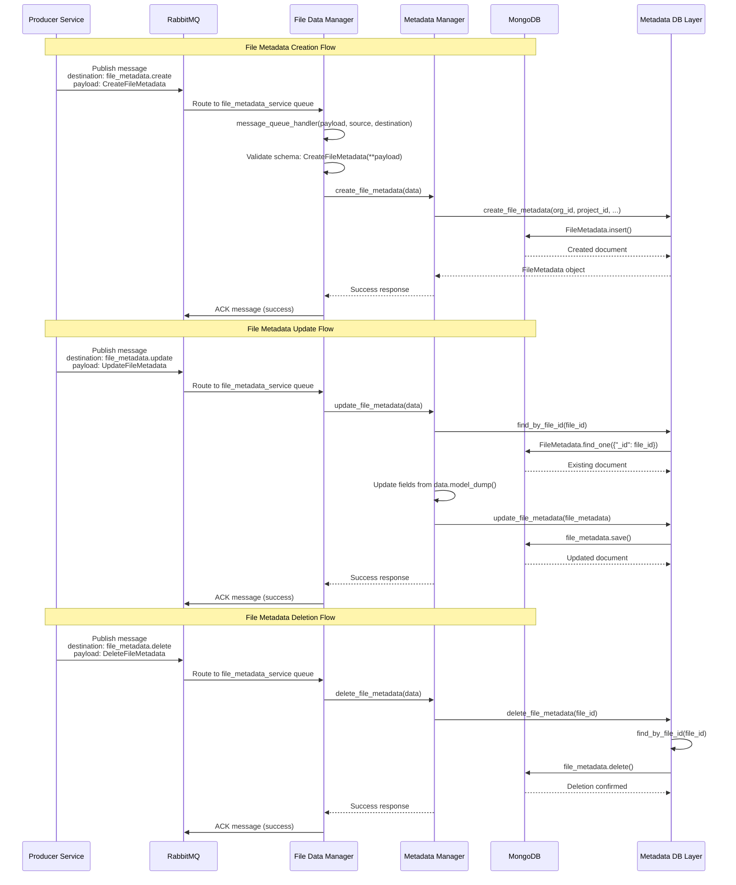
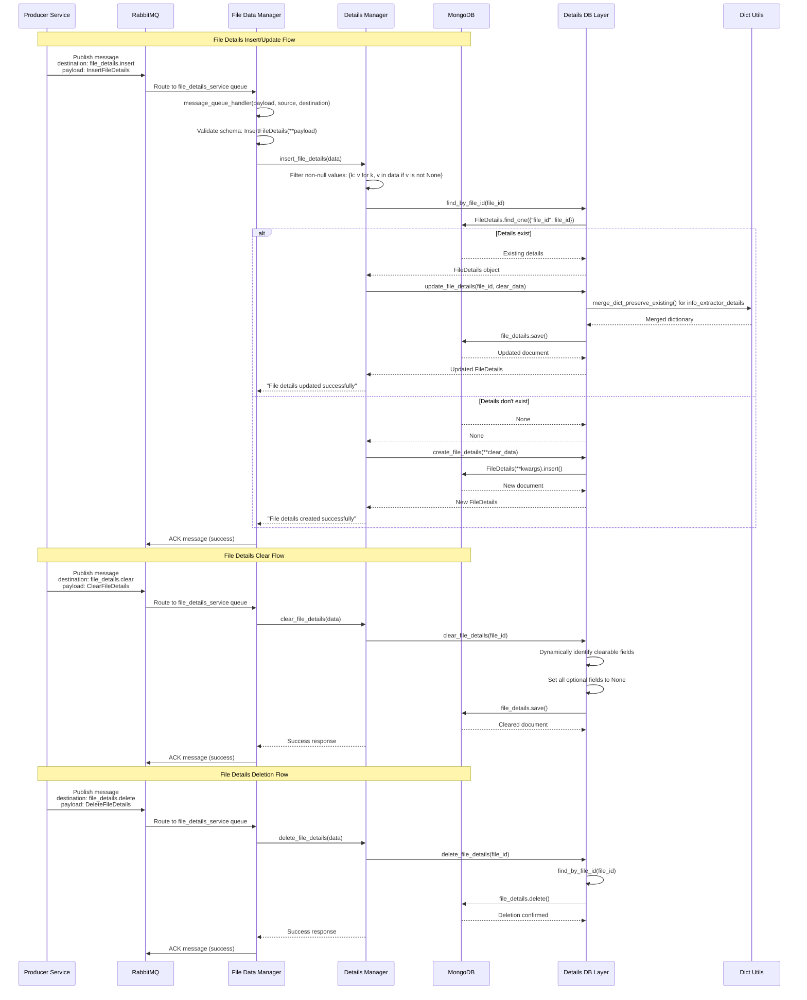

# File Data Manager Service Documentation

## Table of Contents
- [Overview](#overview)
- [Architecture](#architecture)
- [Data Models](#data-models)
- [API Endpoints](#api-endpoints)
- [RabbitMQ Message Handling](#rabbitmq-message-handling)
- [Core Services](#core-services)
- [Database Operations](#database-operations)
- [Service Extensibility](#service-extensibility)
- [Configuration](#configuration)
- [Error Handling](#error-handling)
- [Performance Optimizations](#performance-optimizations)

## Overview

The **File Data Manager Service** is a comprehensive data management service within the KAL ecosystem designed to handle file metadata and detailed file information. It provides centralized file data management with intelligent data merging, extensible model design, and efficient database operations through both REST API and RabbitMQ message processing.

### Core Concepts

#### File Metadata
- **Primary file information** including organization, project, source references
- **Core attributes** like name, size, MIME type, and product classification
- **System tracking** with creation and update timestamps
- **Permission integration** with PID (Permission ID) support
- **Client readiness** flags for file processing states

#### File Details
- **Extended metadata** for AI-generated content and analysis
- **Smart field merging** to preserve existing data during updates
- **Extensible design** allowing easy addition of new detail fields
- **Reference-based** linking to metadata through file_id

#### Product Types & Filtering
The service supports multiple product types with built-in filtering capabilities:
- **kalDocs**: Document files with text analysis support
- **kalAudio**: Audio files with transcription and analysis features  
- **kalMedia**: Media files (images, videos) with content recognition
- **kalTables**: Structured data files with schema analysis

Each product type can have specialized filtering and indexing strategies optimized for their specific use cases.

---

## Architecture

The service follows a layered architecture with clear separation of concerns:

### Service Components

1. **Metadata Manager**: Core business logic for file metadata operations
2. **Details Manager**: Extended file information and AI-generated content management  
3. **Database Layer**: Abstracted database operations with smart merging capabilities
4. **RabbitMQ Handler**: Asynchronous message processing for both metadata and details
5. **Utility Layer**: Shared utilities for error handling, responses, and data operations

### External Integrations
- **Client Applications**: Direct REST API access for data retrieval
- **Other KAL Services**: RabbitMQ message-based interactions
- **Info Extractor Service**: AI analysis results processing
- **MongoDB**: Primary data storage with optimized collections

---

## Data Models

### FileMetadata Document

```python
class FileMetadata(Document):
    org_id: PyObjectId              # Organization ID (indexed for org-based queries)
    source_id: PyObjectId           # Source system ID 
    project_id: PyObjectId          # Project ID for project-based filtering
    pid: Optional[int]              # Permission ID for access control (indexed)
    name: str                       # File name for search and display
    size: int                       # File size in bytes for storage analytics
    mime_type: str                  # File type for content handling
    product: Literal["kalDocs", "kalAudio", "kalMedia"] # Product classification
    path: dict                      # Storage system path details
    is_client_ready: bool           # Processing status flag
    created_at_system: datetime     # System creation timestamp
    created_at_source: datetime     # Source system timestamp (indexed for time-based queries)
    updated_at: datetime            # Last modification timestamp
```

**Indexes**: `pid`, `created_at_source`  
**Collection**: `files_meta`

**Product-Specific Filtering:**
- **kalDocs**: Optimized for text-based searches and content analysis
- **kalAudio**: Indexed for duration and transcription metadata
- **kalMedia**: Enhanced for media type and resolution filtering

### FileDetails Document

```python
class FileDetails(Document):
    file_id: PyObjectId                    # Reference to FileMetadata (indexed)
    # Extractor service integration
    info_extractor_details: Optional[dict] # Service-specific extraction data
    callback_api_url: Optional[str]        # Processing callback endpoint
    # AI-generated content analysis
    summary: Optional[str]                 # AI-generated content summary
    topic: Optional[str]                   # AI-identified topic classification
    frequent_words: Optional[dict]         # Word frequency analysis
    updated_at: datetime                   # Last update timestamp
```

**Indexes**: `file_id`  
**Collection**: `files_details`

**Extensibility Design:**
- **Dynamic Field Addition**: New fields can be added to the model without service changes
- **Smart Merging**: Existing data is preserved when updating with new information
- **Optional Fields**: All detail fields are optional to support incremental data population
## API Endpoints

### File Metadata Retrieval

#### 📖 Get File Metadata
```http
POST /get_file_metadata
Content-Type: application/json

{
    "org_id": "ObjectId",
    "file_id": "ObjectId"
}
```

**Response:**
```json
{
    "status": "success",
    "message": "File metadata retrieved successfully",
    "data": {
        "id": "file_doc_id",
        "org_id": "687de8aed36dc8c2b399732f",
        "source_id": "787de8aed36dc8c2b399733f",
        "project_id": "887de8aed36dc8c2b399734f",
        "pid": -2553401913206115275,
        "name": "document.pdf",
        "size": 1048576,
        "mime_type": "application/pdf",
        "product": "kalDocs",
        "path": {"bucket": "files", "key": "docs/document.pdf"},
        "is_client_ready": true,
        "created_at_system": "2024-01-01T00:00:00Z",
        "created_at_source": "2024-01-01T00:00:00Z",
        "updated_at": "2024-01-01T00:00:00Z"
    }
}
```

### File Details Retrieval

#### 📊 Get File Details
```http
POST /get_file_details
Content-Type: application/json

{
    "org_id": "ObjectId",
    "file_id": "ObjectId"
}
```

**Response:**
```json
{
    "status": "success", 
    "message": "File details retrieved successfully",
    "data": {
        "id": "details_doc_id",
        "file_id": "file_doc_id",
        "info_extractor_details": {
            "word_count": 1500,
            "language": "en",
            "confidence": 0.95
        },
        "callback_api_url": "https://api.example.com/callback",
        "summary": "This document discusses advanced AI techniques...",
        "topic": "Artificial Intelligence",
        "frequent_words": {
            "AI": 45,
            "machine": 32,
            "learning": 28
        },
        "updated_at": "2024-01-01T00:00:00Z"
    }
}
```

---

## RabbitMQ Message Handling

### Message Processing Architecture

The service uses two dedicated RabbitMQ queues for asynchronous processing:

- **file_metadata_service**: Handles metadata operations
- **file_details_service**: Handles details operations

Both queues bind to the `kal_sense` exchange with their respective routing keys.

### Metadata Message Flows



### Details Message Flows



### Message Routing

#### Metadata Operations
- **Destination**: `file_metadata.create` → Creates new file metadata
- **Destination**: `file_metadata.update` → Updates existing metadata fields
- **Destination**: `file_metadata.delete` → Removes metadata record

#### Details Operations  
- **Destination**: `file_details.insert` → Creates or updates file details (smart merge)
- **Destination**: `file_details.clear` → Resets all detail fields to None
- **Destination**: `file_details.delete` → Removes details record entirely

---

## Core Services

### Metadata Manager

**Primary Functions:**
- `create_file_metadata()`: Create new file metadata with validation
- `update_file_metadata()`: Update existing metadata with partial updates
- `delete_file_metadata()`: Remove metadata records
- `get_file_metadata()`: Retrieve metadata by file ID

**Key Features:**
- **Validation Integration**: Automatic schema validation using Pydantic
- **Timestamp Management**: Automatic created_at_system and updated_at handling
- **Product Type Support**: Built-in support for kalDocs, kalAudio, kalMedia, kalTables
- **Exception Safety**: Comprehensive error handling with consistent responses

### Details Manager

**Primary Functions:**
- `insert_file_details()`: Create or update details with smart merging
- `clear_file_details()`: Reset details fields while preserving structure
- `delete_file_details()`: Remove details records completely
- `get_file_details()`: Retrieve details by file ID

**Key Features:**
- **Smart Data Merging**: Preserves existing data during updates using `merge_dict_preserve_existing()`
- **Dynamic Field Handling**: Automatically handles new fields added to the model
- **Non-null Filtering**: Only processes fields with actual values
- **Extensible Design**: Easy addition of new detail types without service changes

---

## Database Operations

### Metadata Database Layer

**Core Operations:**
```python
# Create metadata
await metadata_db.create_file_metadata(
    org_id=org_id,
    project_id=project_id, 
    product=product,
    source_id=source_id,
    name=name,
    size=size,
    mime_type=mime_type
)

# Find by file ID
metadata = await metadata_db.find_by_file_id(file_id)

# Update metadata
await metadata_db.update_file_metadata(file_metadata)

# Delete metadata
await metadata_db.delete_file_metadata(file_id)
```

**Indexing Strategy:**
- **Primary Index**: `_id` for direct file lookups
- **Permission Index**: `pid` for permission-based queries
- **Time Index**: `created_at_source` for temporal filtering
- **Composite Indexes**: `org_id + product` for organization-product queries

### Details Database Layer

**Core Operations:**
```python
# Create details (extensible)
await details_db.create_file_details(**kwargs)

# Smart update with merging
await details_db.update_file_details(file_id, update_data)

# Dynamic field clearing
await details_db.clear_file_details(file_id)

# Find by file reference
details = await details_db.find_by_file_id(file_id)
```

**Smart Merging Algorithm:**
```python
def merge_dict_preserve_existing(existing_dict, new_dict):
    """
    Preserves existing data while adding new keys.
    For info_extractor_details: merges dictionaries intelligently.
    For other fields: only updates if current value is None.
    """
    merged = existing_dict.copy() if existing_dict else {}
    for key, value in new_dict.items():
        if key not in merged:
            merged[key] = value
    return merged
```
## Service Extensibility

### Adding New Detail Fields

The service is designed for easy extensibility. To add new detail fields:

1. **Update the Model** (`src/models/details.py`):
```python
class FileDetails(Document):
    # Existing fields...
    new_analysis_field: Optional[dict] = Field(default=None, description="New analysis data")
    ai_confidence_score: Optional[float] = Field(default=None, description="AI confidence rating")
```

2. **Update the Schema** (`src/schemas/details.py`):
```python
class InsertFileDetails(FileAPIBase):
    # Existing fields...
    new_analysis_field: Optional[dict] = None
    ai_confidence_score: Optional[float] = None
```

3. **No Service Changes Required**: The service automatically supports new fields through:
   - Dynamic field handling in `create_file_details()`
   - Smart merging in `update_file_details()`
   - Automatic clearing in `clear_file_details()`

### Product Type Extensions

To add new product types:

1. **Update Product Enum** (`src/schemas/metadata.py`):
```python
class Product(str, Enum):
    DOCS = "kalDocs"
    AUDIO = "kalAudio"
    MEDIA = "kalMedia"
    TABLES = "kalTables"
    PRESENTATIONS = "kalPresentations"  # New product type
```

2. **Update Model** (`src/models/metadata.py`):
```python
product: Literal["kalDocs", "kalAudio", "kalMedia", "kalTables", "kalPresentations"]
```

3. **Add Product-Specific Filtering** (if needed):
```python
# Custom indexes or processing logic for the new product type
```

### Message Destination Extensions

To add new message processing capabilities:

1. **Update Handler** (`src/events/rabbit_handler.py`):
```python
match destination:
    # Existing cases...
    case "file_metadata.archive":
        data = ArchiveFileMetadata(**payload)
        await file_metadata_service.archive_file_metadata(data)
    case "file_details.analyze":
        data = AnalyzeFileDetails(**payload)
        await file_details_service.analyze_file_details(data)
```

2. **Implement Service Methods**: Add corresponding methods to managers
3. **Create Schemas**: Define new request/response schemas

---

## Configuration

### Environment Variables

```bash
# Application Settings
PORT=8080
WORKERS=1
ENVIRONMENT=local
SERVICE_NAME=file_data_manager

# MongoDB Configuration
MONGO_CONNECTION_STRING=mongodb://localhost:27017/
MONGO_DB=coreDB

# RabbitMQ Configuration
RABBITMQ_HOST=localhost
RABBITMQ_PORT=5672
RABBITMQ_USER=guest
RABBITMQ_PASS=guest123
RABBITMQ_PROTO=amqp

# Dead Letter Queue Settings
DLQ_MAX_RETRY_ATTEMPTS=3
DLQ_MESSAGE_TTL=3600000
DLQ_ENABLE_MONITORING=true
```

### Database Settings

```python
class Settings:
    # MongoDB tuning
    MONGO_MAX_POOL_SIZE: int = 200
    MONGO_MIN_POOL_SIZE: int = 10
    MONGO_WAIT_QUEUE_TIMEOUT_MS: int = 5000
    MONGO_CONNECT_TIMEOUT_MS: int = 10000
    MONGO_SERVER_SELECTION_TIMEOUT_MS: int = 5000
    MONGO_SOCKET_TIMEOUT_MS: int = 20000
```

### Startup Sequence

1. **Database Initialization**: Connect to MongoDB with optimized connection pooling
2. **Model Registration**: Initialize Beanie ODM with FileMetadata and FileDetails models
3. **RabbitMQ Setup**: Configure consumers for both metadata and details queues
4. **API Routes**: Initialize FastAPI endpoints with dependency injection
5. **Health Checks**: Verify database and message queue connectivity

---

## Error Handling

### Exception Management

All service methods use the `@exception_handler` decorator for consistent error handling:

```python
@exception_handler("Error creating file metadata")
async def create_file_metadata(self, data: CreateFileMetadata) -> Dict[str, Any]:
    # Method implementation with automatic error catching
```

### Error Response Format

```json
{
    "status": "failed",
    "message": "Error creating file metadata",
    "validation_errors": ["field1: error", "field2: error"]
}
```

### DLQ (Dead Letter Queue) Handling

**Message Failure Processing:**
- Failed messages are automatically routed to Dead Letter Queues
- Configurable retry attempts (default: 3)
- Message TTL for automatic cleanup (default: 1 hour)
- Monitoring integration for failed message alerting

**Failure Scenarios:**
- Schema validation failures
- Database connection errors
- Business logic exceptions
- Timeout errors

---

## Performance Optimizations

### Database Optimizations

#### Connection Pooling
```python
# Optimized MongoDB connection pool
AsyncIOMotorClient(
    connection_string,
    maxPoolSize=200,
    minPoolSize=10,
    waitQueueTimeoutMS=5000,
    connectTimeoutMS=10000,
    retryWrites=True
)
```

#### Index Strategy
```javascript
// Metadata collection indexes
db.files_meta.createIndex({"org_id": 1})
db.files_meta.createIndex({"pid": 1})
db.files_meta.createIndex({"created_at_source": 1})
db.files_meta.createIndex({"org_id": 1, "product": 1})
db.files_meta.createIndex({"project_id": 1})

// Details collection indexes  
db.files_details.createIndex({"file_id": 1})
db.files_details.createIndex({"file_id": 1, "updated_at": 1})
```

#### Query Optimizations
- **Single Lookups**: Use indexed fields for fast retrieval
- **Projection**: Return only required fields to reduce data transfer
- **Efficient Updates**: Use partial updates with `model_dump(exclude_unset=True)`

### Message Processing Optimizations

#### Async Processing
- **Non-blocking I/O**: Full async/await pattern for concurrent message handling
- **Connection Reuse**: Shared database connections across message handlers
- **Batch Processing**: Efficient handling of multiple messages

#### Schema Validation
- **Fast Validation**: Pydantic-based validation with type hints
- **Early Rejection**: Invalid messages rejected before database operations
- **Memory Efficient**: Minimal object creation during validation

### Application Optimizations

#### Smart Data Merging
```python
# Efficient dictionary merging for info_extractor_details
def merge_dict_preserve_existing(existing_dict, new_dict):
    if existing_dict is None:
        return new_dict.copy()
    merged = existing_dict.copy()
    for key, value in new_dict.items():
        if key not in merged:
            merged[key] = value
    return merged
```

#### Memory Management
- **Object Lifecycle**: Proper cleanup of database connections and objects
- **Garbage Collection**: Efficient memory usage with minimal object retention
- **Resource Pooling**: Shared resources across requests

---

## Integration Examples

### Creating File Metadata via RabbitMQ

```python
# Producer service sending file creation message
await publish_message(
    exchange="kal_sense",
    routing_key="file_metadata_service",
    message={
        "destination": "file_metadata.create",
        "org_id": "687de8aed36dc8c2b399732f",
        "project_id": "787de8aed36dc8c2b399733f", 
        "source_id": "887de8aed36dc8c2b399734f",
        "product": "kalDocs",
        "name": "report.pdf",
        "size": 2048576,
        "mime_type": "application/pdf"
    }
)
```

### Adding AI Analysis Results

```python
# Info extractor service sending analysis results
await publish_message(
    exchange="kal_sense",
    routing_key="file_details_service",
    message={
        "destination": "file_details.insert",
        "org_id": "687de8aed36dc8c2b399732f",
        "file_id": "file_doc_id",
        "summary": "Quarterly financial report showing 15% growth",
        "topic": "Financial Analysis",
        "frequent_words": {"revenue": 23, "growth": 18, "profit": 15},
        "info_extractor_details": {
            "page_count": 45,
            "word_count": 8500,
            "language": "en",
            "confidence": 0.97
        }
    }
)
```

### Retrieving Combined Data

```python
# Client application getting complete file information
async def get_complete_file_info(org_id: str, file_id: str):
    # Get metadata
    metadata_response = await post("/get_file_metadata", {
        "org_id": org_id,
        "file_id": file_id
    })
    
    # Get details
    details_response = await post("/get_file_details", {
        "org_id": org_id, 
        "file_id": file_id
    })
    
    return {
        "metadata": metadata_response["data"],
        "details": details_response["data"]
    }
```

---
